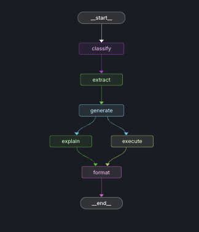

# Enhancements Summary

This document outlines the key changes made to the **workflow_agent.py**.

---

## 1. Added the “Explain Query” Step

### **Purpose**
The new `explain_query` node generates a **human-readable explanation** of the Cypher query created by the model.  
It helps users understand what the query is doing before or alongside execution.

---

### **Key Additions**

- Added `query_explanation` field to the `WorkflowState` dictionary.

- Implemented a new method:
  ```python
  def explain_query(self, state: WorkflowState) -> WorkflowState:
      cypher_query = state.get("cypher_query")
      if not cypher_query:
          return {}
      prompt = (
          "Explain in simple terms what this Cypher query does and what it will return."
      )
      explanation = self._get_llm_response(prompt, max_tokens=180)
      return {"query_explanation": explanation}
    ```

- Integrated this node into the workflow graph.

- Updated the integration test (test_workflow_agent.py) to include:
    - Mock response for explain_query
    - New assertion for "query_explanation" in the test result

### **Impact**

Each question now produces both:
- A query explanation (plain-language description of the Cypher query)
- This improves transparency and interpretability of responses.

## 2. Parallelized “Explain Query” and “Execute Query” Steps



### **Purpose**
Both explain_query and execute_query use the same Cypher query but perform independent tasks. They can safely run in parallel to reduce total response time.

### **Key Changes**

#### **Workflow Graph**

Replaced the sequential edges:
```python
    workflow.add_edge("generate", "explain")
    workflow.add_edge("explain", "execute")
```

with parallel structure:
```python
workflow.add_edge("generate", "explain")
workflow.add_edge("generate", "execute")
workflow.add_edge("explain", "format")
workflow.add_edge("execute", "format")
```

- Modified format_answer to handle partial updates gracefully:
    - Waits for both results and query_explanation to become available.
    - Avoids overwriting shared keys during concurrent updates.
    - Combines both outputs into a single formatted final answer.
    - To prevent concurrent write conflicts, each node now returns only the fields it modifies.
    - This eliminates InvalidUpdateError caused by multiple nodes writing to the same key
 
### **Impact**

Each question now produces both:
- The workflow now runs the explain and execute steps simultaneously, reducing latency.
- By returning only modified fields, the system avoids concurrent write conflicts, improving reliability and scalability.
